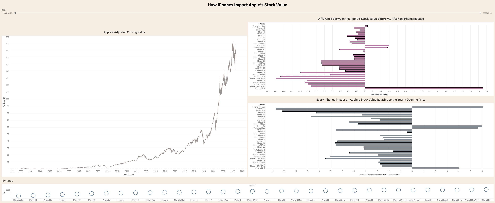

# Group 11 - A Deeper Look into Apple's Stock Value

## Milestones

Details for Milestone are available on Canvas (left sidebar, Course Project).

## Describe your topic/interest in about 150-200 words

The main reason why we chose this dataset was to advance our knowledge regarding the stock market. Also, we are all very interested and intrigued by tech, so we decided to combine the two ideas and analyze the stock value of Apple. We narrowed our decision down to Apple because they a very influential company in the tech industry and they have an exciting financial past. Next, we hope this dataset will allow us to construct a time-graph visualization where we can pick out significant points in the data. A user-facing dashboard will allow us to add additional information, at these significant points, into the timeline of our data such. We would like to add in information such as news articles, innovation during the time, new products, new software, and investment advice at the particular time. Lastly, we are fascinated to see if an analysis of this dataset will result in insight for future investment opportunities.

## Describe your dataset in about 150-200 words

Our data set includes the opening, closing, adjusted closing, high, and low market value of Apple for every day from January 3, 2010 to December 29, 2022. The data set also includes the volume of Apple’s stock for every day during the same time period. This dataset was found on Kaggle where it was retrieved from Yahoo Finance’s historical data of stock prices; therefore, we can conclude that this data is accurate and up to date. Next, we believe that our data’s main purpose is to provide transparency for Apple’s stakeholders regarding the success of the company. In addition, the data can be used to understand the public’s opinion of Apple as a company over the last decade by analyzing the slopes of the data.

## Team Members

- Davis Franklin: I am a second year studying computer science, and I spend my time away from university in the summer working for the BCWS on the Vesta unit crew fighting wildfires.  
- Person 2: one sentence about you!

## Images

## References

{Add your stuff here}

