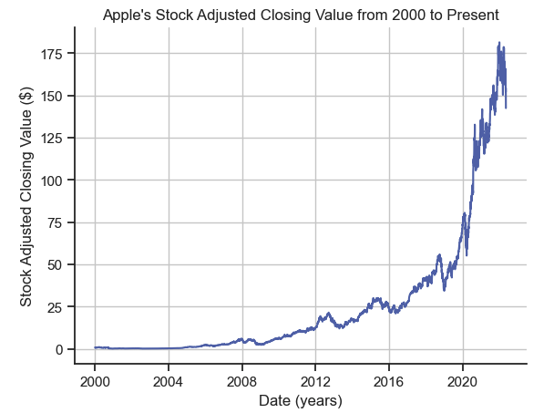
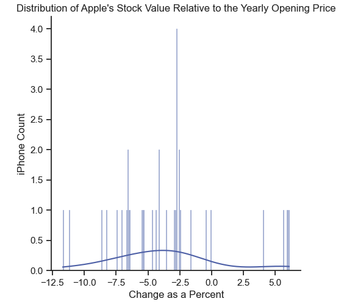
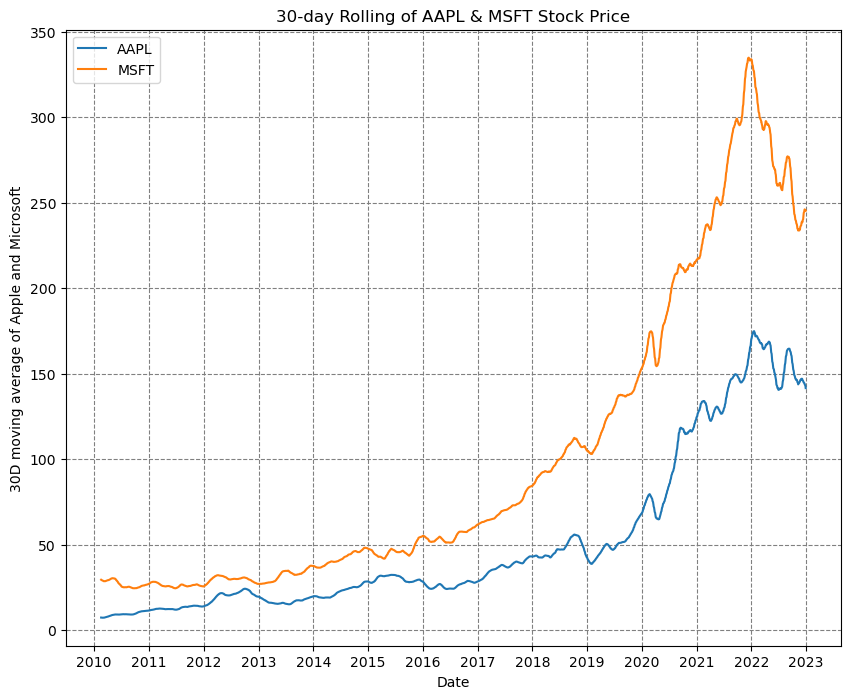
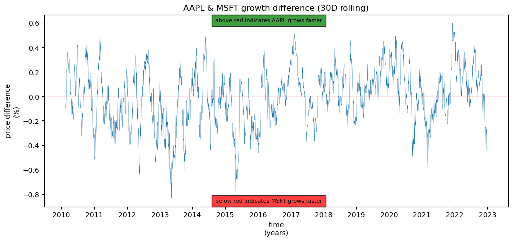
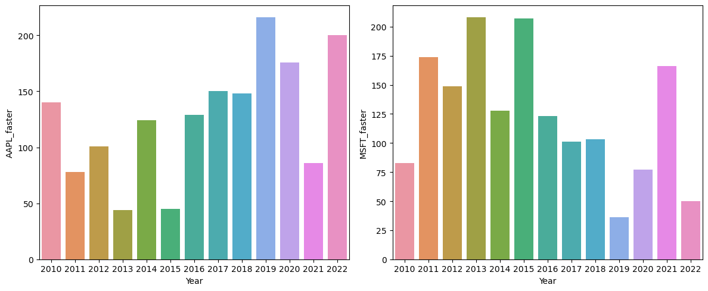

# A Deeper Look into Apple's Stock Value

## Introduction

Our project focuses on Apple's Stock Value, specifically, what factors contribute to the value of Apples’ stock and how Apple's stock value compares to other companies in the same industry. To investigate these focuses we chose to look at how iPhones impacted Apple's stock value as the factor and how Apple's stock values compare to Microsoft’s stock value as the comparison. The main dataset that we are using to conduct this exploratory data analysis is a dataset that contains Apple's opening, closing, high, low, adjusted closing stock values, and Apple's stock volume for the entire time Apple has been publicly traded company. Further, for analysis number 1, a dataset was created that contained every iPhone and the date it was released to further study how the release of iPhones impacted Apple's stock value. For analysis number 2 a dataset the contained the same information as the main Apple dataset was used to analyze how Apple’s stock value compared to Microsoft’s stock value.

&nbsp;

---

## Why This Topic?

We chose this topic for our research project because we are computer science students who are interested in tech and big tech companies. We narrowed down the options of companies to Apple because we both use their products, and we both view them as an interesting company to analyze.

&nbsp;

---

## Exploratory Data Analysis

### Analysis #1

In this part of the Exploratory Data Analysis, the main Apple stock value dataset and the iPhone dataset were used to answer the question: determine the overall impact of iPhones on Apple's stock value and identify the iPhone releases that had the largest positive and negative impacts on the stock value. In this final report the main question, what is the overall impact of iPhones on Apple’s stock value, will be highlighted.

First, to get a better understanding of how Apple's stock value has fluctuated over time the next plot shows Apple's adjusted closing value from the year 2000 to 2022:

From this plot we can see that Apple's stock value has increased since the release of the first iPhone in 2007. Also, from this plot we can see that Apple's stock value was very low before the release of the first iPhone compared to after the release of the first iPhone. From this we can conclude that iPhones have not had a negative impact on Apple’s stock value because the stock value is still increasing.

Next, to get a deeper understanding of how each iPhone has impacted Apple's stock value a new column was added to dataset called percent change. The percent change column was added to determine how significant each iPhone’s impact was on the stock value. The percent change column was calculated by first taking the average of the adjusted closing values in the two-week period before an iPhone was release and subtracted from average of the two-week period after the release. Then this value was divided by the yearly opening price and multiplied by one hundred to get a percent relative to the yearly opening price of how significant each iPhone’s release was on Apple’s stock value. The percent change is shown in the next plot as a distribution of the percent change of all the iPhones.

Here we can see that the probability density function peaks at around negative four. This tells us that the majority of iPhones had a negative impact on Apple’s stock value. 

This conclusion of iPhones being detrimental to the stock value brings contradiction to the question because in the first plot we can see an increasing trend. Therefore, we can conclude that iPhones do not significantly impact Apple’s stock value and should not be used to judge long term trends in Apple’s stock value.

### Analysis #2  

**introduction:**  
This analysis uses datasets for AAPL and MSFT stocks since 2010. Initially, the datasets include date, open, close, high, low, adjacent close, and volume columns; of which, many were useless to this analysis. The only relevant columns were date and close, which provided enough information to conduct this analysis. The purpose of this analysis was to discover information about the relation between Apple's and Microsoft's share price. This topic is important because it could allow investors to understand which company may be more resilient during times of market downturn.

**Section 1**  
My first question was "How does the stock price of a tech company compare to the stock price of its competitors at a certain time?" For example, if Apple (AAPL: NASDAQ) and Microsoft (MSFT: NASDAQ) have common price increases, and say APPL increases by 10%, could we discover more details about the market price of MSFT?  Initially, I discovered the 30 day rolling prices of both stocks. This means the previous 30 days brought to an average, which helps clean up our visualizations and understand more of a short-long term change in price. See below
  
After looking at the prices of both stocks, I concluded that the share price is not enough information to understand the value of the company entirely. In fact, I discovered that a companies market cap is based on share price multiplied by the number of currently outstanding shares (which is data discluded from the dataset). Microsoft, currently a 2.2 trillion dollar company, has a higher share price than Apple, which is currently a 2.7 trillion dollar company. This means the number of outstanding shares is a key value in realizing a companies total value.  

**Section 2**  
In order to combat this lack of data, I decided to instead graph the percent changes between both companies. Now, my question becomes "What information can be found by comparing the price percent changes between two companies?". See below
  
After exploring the difference in price percent changes between AAPL and MSFT, I could see periods of time where one stocks was growing faster than the other. This could be useful to an investor doing research in a companies relience to real world events.  

**Section 3**  
I was still curious to answer the question "Am I able to analyze what years each company did better in?". To do this, I created a dataframe that summed up the amount of days each company performed better than the other. I then visualized this table in two seaborn barcharts.
  
Then, I was able to see what years each company outperformed the other. This information is valuable to investors because recent data may help them better understand which company is currently performing better, based on a percent change calculation.  

**Analysis 2 Conclusion**  
After analyzing and visualizing the stock market data of AAPL and MSFT, I am able to compare the companies competitive history. This allows me to understand the resilience of each stock and dive further into what caused one company to outperform the other. I was, however, unable to understand if the share values were influenced by competition between apple and microsoft, or if there was a tech industry decline. Throughout the analysis, I also realized the share value was not the only relevant information to understanding a companies value.

&nbsp;

---

## Summary/ Conclusion

After conducting this project, we have gained a deeper understanding of how stocks work through the exploration of Apple’s stock. From analysis number one we discovered that iPhones do not have a significant impact on Apple’s stock value. Also, the iPhone 1st Gen was the most successful iPhone and the iPhone 3G was the least successful iPhone for Apple regarding the drop in Apple’s stock value after their release. From this we able to learn how to analyze the release of a product’s impact on a company’s stock value. From analysis number two

Overall, from this project we able to expand our data skills
