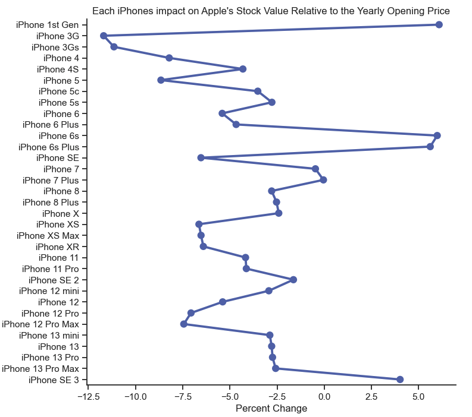

# A Deeper Look into Apple's Stock Value

## Introduction

Our project focuses on Apple's Stock Value, specifically, what factors contribute to the value of Apples’ stock and how Apple's stock value compares to other companies in the same industry. To investigate these focuses we chose to look at how iPhones impacted Apple's stock value as the factor and how Apple's stock values compare to Microsoft’s stock value as the comparison. The main dataset that we are using to conduct this exploratory data analysis is a dataset that contains Apple's opening, closing, high, low, adjusted closing stock values, and Apple's stock volume for the entire time Apple has been publicly traded company. Further, for analysis number 1, a dataset was created that contained every iPhone and the date it was released to further study how the release of iPhones impacted Apple's stock value. For analysis number 2 a dataset the contained the same information as the main Apple dataset was used to analyze how Apple’s stock value compared to Microsoft’s stock value.

&nbsp;

---

## Why This Topic?

We chose this topic for our research project because we are computer science students who are interested in tech and big tech companies. We narrowed down the options of companies to Apple because we both use their products, and we both view them as an interesting company to analyze.

&nbsp;

---

## Exploratory Data Analysis

### Analysis #1

In this part of the Exploratory Data Analysis, the main Apple stock value dataset and the iPhone dataset are going to be used to answer the question: determine the overall impact of iPhones on Apple's stock value and identify the iPhone releases that had the largest positive and negative impacts on the stock value.

First, to get a better understanding of how Apple's stock value has fluctuated over time the next plot shows Apple's adjusted closing value from the year 2000 to 2022:

From this plot we can see that Apple's stock value has increased since the release of the first iPhone in 2007. Also, from this plot we can see that Apple's stock value was very low before the release of the first iPhone compared to after the release of the first iPhone.

Next, to get a deeper understanding of how each iPhone has impacted Apple's stock value a new column was added to dataset called percent change. The percent change column was added to determine how significant each iPhone’s impact was on the stock value. The percent change column was calculated by first taking the average of the adjusted closing values in the two-week period before an iPhone was release and subtracted from average of the two-week period after the release. Then this value was divided by the yearly opening price and multiplied by one hundred to get a percent relative to the yearly opening price of how significant each iPhone’s release was on Apple’s stock value. The percent change is visualized in the following plot.

From this plot we can answer the question, which iPhone had the largest positive and which iPhone had the largest negative impact on Apple’s stock value. In the plot we can see that the iPhone 1st Gen has the largest positive impact at around six percent, and we can see that the iPhone 3G has the largest negative impact at around negative twelve percent.

### Analysis #2  

&nbsp;

---

## Summary/ Conclusion
